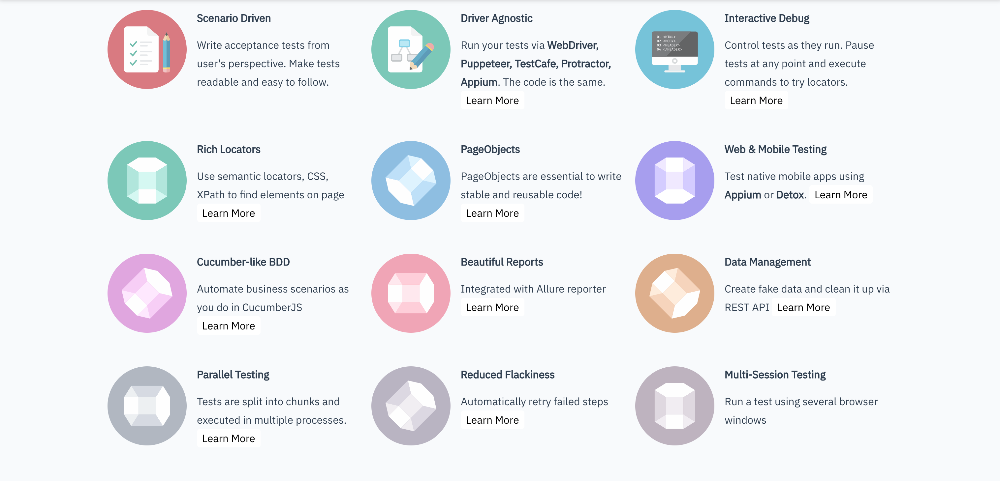

## About CodeceptJS
CodeceptJS is a testing framework for end-to-end testing with WebDriver(our choice) or others.
We can use other test drivers of our choice and easily replace with WebDriver as it is
backend agnostic and isn't aware of which driver is running the tests.

## A simple test
    `Feature('login');
     
     Scenario('test login workflow', (I, loginHelper) => {
         /**
          * A test to verify login workflow
          */
          I.amOnPage('/');
          loginHelper.login();
          I.see('Home');
          loginHelper.logout();
     });`
 
 * Tests are synchronous
 * Written from user's perspective
 * Makes extensive use of dependency injection
 
 More information on how to write and manage tests can be found here: 
 [Writing tests](https://codecept.io/basics/#writing-tests)
 
## Features

* Based on Mocha testing framework.
* Smart locators: use names, labels, matching text, CSS or XPath to locate elements.
* Interactive debugging shell: pause test at any point and try different commands in a browser.

## Helpful Resources

[Getting Started](https://codecept.io/basics/#architecture)
 
[Using Selenium Webdriver](https://codecept.io/webdriver/#what-is-selenium-webdriver)
 
[Writing tests](https://codecept.io/webdriver/#writing-tests)
 
[CodeceptJS recommended best practices](https://codecept.io/best/#focus-on-readability)
 
[WebDriver Helpers](https://codecept.io/helpers/WebDriver/)
 
[REST helper](https://codecept.io/helpers/REST/#rest)
 
[CodeceptJS cli commands](https://codecept.io/commands/)
